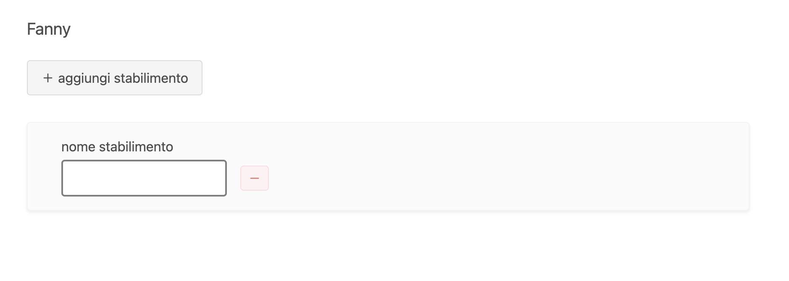
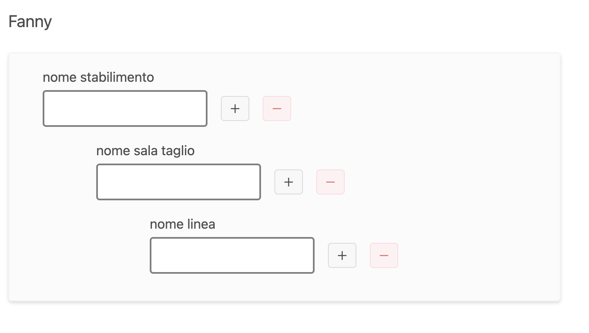

[Prototipi](https://luc4leone.github.io/ui-protos/index.html) > **Gerarchia Analytics**
# Gerarchia Analytics

Componente che permette di creare una gerarchia in uno stabilimento.

## [wireframe](wireframe.html)

## [versione 5](v5.html)
- dopo varie iterazioni, la v5 è una buona base di partenza.

## [versione 7](v7.html)
- tolgo il bottone "aggiungi stabilimento" sopra lo stabilimento perché mi sono accorto che se cancello una sala senza aver aggiunto altre sale, posso trovarmi in una situazione che non ha molto senso:

- aggiungo il bottone "＋" in parte alla input del nome stabilimento, come per tutti gli altri campi
- mostro subito uno stabilimento come initial state

## [versione 8](v8.html)
- noto che se tolgo l'unica macchina che ho, non avrò mai più uno stabilimento valido

- la prima soluzione che mi viene in mente è sostituire la macchina tolta con un bottone "aggiungi macchina" se la macchina tolta è unica, altrimenti tolgo la macchina
- potrei togliere il bottone "rimuovi macchina" dall'ultima macchina rimasta, ma non mi piace, toglie libertà all'utente
- ho migliorato la validazione delle input: se contiene uno o più spazi bianchi il campo non viene validato

---
Luca Leone  
[Il mio sito web](https://birbi.biz)