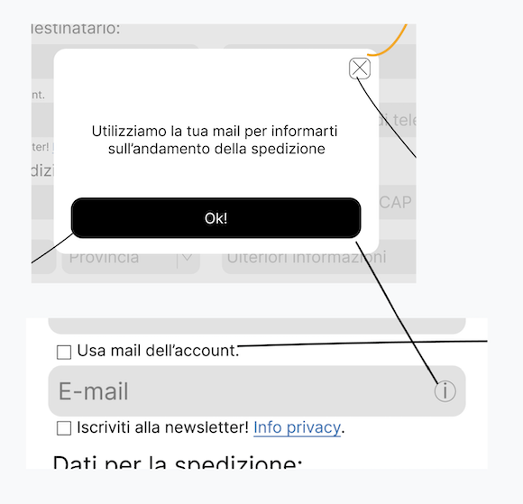
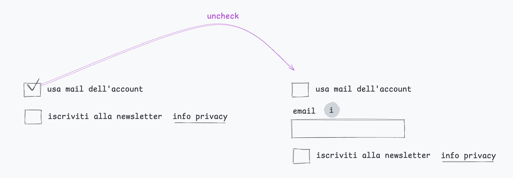

[Prototipi](../index.html) > **Usa email account**
# Usa email account

Estensione di un'idea di Riccardo Porrega, classe 2 corso UX/UI Boolean.

Il succo: per creare qualcosa di originale e valido occorre passare da idee che possono essere fragili o del tutto errate. Fa parte del processo creativo. Se ti censuri a priori, se non passi da roba che non sta in piedi, non arrivi a roba valida.

[Video della mia recensione](https://www.loom.com/share/12e7906ebc4448439ebf8cc500a7af45?sid=b62837f5-104f-4452-8b32-702dca6a4718).

## [versione 1](v1.html)
Parto dall'idea di Riccardo.

Arrivo qui:

---
Luca Leone  
[Il mio sito web](https://birbi.biz)